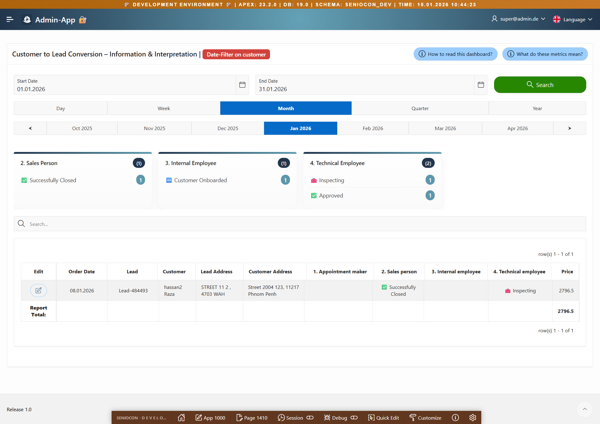

# Oracle APEX KPI Funnel Dashboard

A reference implementation of a Lead → Customer KPI funnel dashboard built with Oracle APEX. It demonstrates server-side KPI rendering, centralized timeframe intelligence, and native smart filters for a clean, maintainable analytics page.

## Dashboard preview



## Features

- Lead-to-customer funnel KPIs rendered server-side for accuracy.
- Centralized timeframe resolution for consistent date ranges across regions.
- Smart Filters using FACET_COLUMN with built-in counts.
- Clear separation between SQL objects, APEX page export, and documentation.

## Tech stack

- Oracle Database (tables, views, PL/SQL)
- Oracle APEX (page 1410)
- SQL/PLSQL scripts for setup and time intelligence

## Installation

1. Create or select an Oracle schema for the dashboard.
2. Run the SQL scripts in order from the `sql/` directory.
3. Import `apex/page-1410/page-1410.sql` into your APEX application.
4. Ensure the time intelligence package is accessible to the APEX schema.
5. Open page 1410 and verify the KPIs and report render with sample data.

## Repository structure

```
/
├─ apex/
│  └─ page-1410/
│     ├─ page-1410.sql
│     └─ README.md
│
├─ sql/
│  ├─ 01_tables.sql
│  ├─ 02_sample_data.sql
│  ├─ 03_views.sql
│  ├─ 04_time_intelligence_pkg.sql
│  └─ README.md
│
├─ docs/
│  ├─ dashboard.png
│  ├─ architecture.md
│  ├─ time-intelligence.md
│  └─ smart-filters.md
│
├─ README.md
├─ LICENSE
└─ .gitignore
```

## How the KPI funnel works

The funnel starts with leads and progresses to customers. KPI cards query aggregated counts from the lead and customer tables, filtered by the active timeframe and the selected smart filters. The timeframe resolution is handled by PL/SQL, ensuring every KPI and report region uses the same date range.

## License

This project is licensed under the terms of the LICENSE file.
